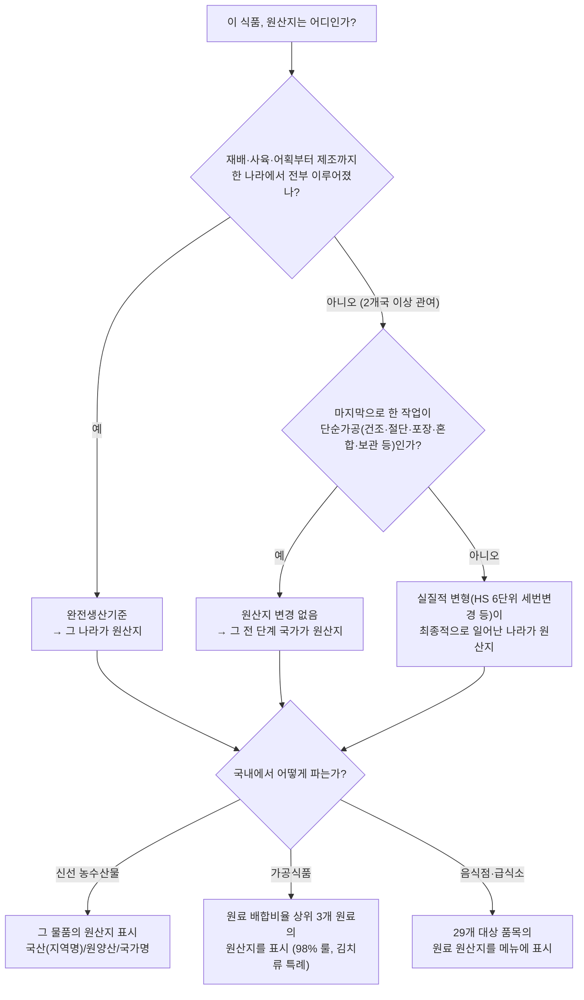

# 식품·가공식품 원산지 결정 기준 학습 노트

> 식품(농수산물)과 가공식품의 원산지가 **어떻게 판정되고, 어떻게 표시해야 하는지**를
> 법령 기준으로 정리한 학습용 문서입니다.
>
> - 기준 시점: 2026년 8월 조사 (법령·고시는 수시로 개정되므로, 실무 적용 전 [국가법령정보센터](https://www.law.go.kr)와 국립농산물품질관리원 안내를 꼭 확인하세요)
> - 참고: 요청하신 네이버 블로그(관세사 칼럼)는 이 작업 환경에서 접근이 차단되어 직접 인용하지 못했고, 같은 주제를 법령 원문과 정부기관 자료 기준으로 재구성했습니다.

---

## 0. 한눈에 보기

원산지 제도는 **두 개의 축**으로 이해하면 쉽습니다.

| 구분 | ① 원산지 "판정" (어느 나라 물건인가) | ② 원산지 "표시" (소비자에게 어떻게 알리나) |
|---|---|---|
| 근거 법령 | 대외무역법 제33조·시행령 제61조, 대외무역관리규정 제85조~제86조, 관세법 | 농수산물의 원산지 표시 등에 관한 법률(원산지표시법)과 시행령·시행규칙, 「농수산물의 원산지표시요령」(고시) |
| 적용 장면 | 수출입 통관, 무역 거래 | 국내 판매·유통, 온라인 판매, 음식점·급식소 |
| 핵심 원칙 | 완전생산기준 → 실질적 변형(세번변경) → 단순가공 배제 | 신선식품은 그 물품의 원산지, **가공식품은 "원료"의 원산지** |
| 관리 기관 | 관세청, 산업통상자원부 | 농림축산식품부·해양수산부, 국립농산물품질관리원(농관원), 국립수산물품질관리원(수품원) |

### 결정 흐름 요약 (플로우차트)

> 💡 **가장 중요한 한 문장**: 신선식품은 "그 물건"의 원산지를, 가공식품은 "만든 나라"가 아니라 **"주요 원료"의 원산지**를 표시한다.

---

## 1. 원산지 제도의 기본 구조

### 1.1 원산지(Country of Origin)란?

- 물품이 **생산·채취·제조된 국가**. 동식물은 성장한 나라, 공산품·가공품은 "실질적 제조"가 일어난 나라를 말합니다.
- 단순히 "선적한 나라", "수입해 온 나라(경유국)"가 아니라는 점이 핵심입니다.

### 1.2 왜 필요한가

1. **소비자 보호**: 알권리 보장, 국산 둔갑 방지
2. **관세 행정**: FTA 특혜세율 적용 여부, 덤핑방지관세 등 무역 조치의 대상 판별
3. **공정 거래**: 생산자 보호, 유통 질서 확립

### 1.3 특혜 원산지 vs 비특혜 원산지

| 구분 | 비특혜(일반) 원산지 | 특혜 원산지 |
|---|---|---|
| 목적 | 원산지 표시, 무역 통계, 무역 규제 | FTA 등 협정 관세 혜택 부여 |
| 근거 | 대외무역법, 관세법 | 각 FTA 협정문, 자유무역협정 관세특례법 |
| 기준 | 완전생산 + 실질적 변형(세번변경) | 협정별 품목별 원산지기준(PSR) — 협정마다 다름 |

→ 이 문서의 본문(2~5장)은 **비특혜 기준 + 국내 표시 기준**을 다루고, FTA는 7장에서 개요만 정리합니다. **같은 물품이라도 두 기준의 판정 결과가 다를 수 있습니다.**

---

## 2. 원산지 판정의 3대 원칙 (대외무역법 — 수출입 물품)

수입 식품·원료의 원산지는 대외무역법령(대외무역관리규정 제85조)에 따라 판정합니다. 국내 표시 제도(원산지표시법)도 "수입 농수산물의 원산지 = 대외무역법에 따라 통관 시 판정된 원산지"를 그대로 가져다 쓰므로, 이 3원칙이 모든 논의의 출발점입니다.

### 2.1 완전생산기준 (Wholly Obtained)

물품 **전부가 하나의 국가에서** 채취·생산된 경우, 그 나라가 원산지입니다. 농수산물 대부분이 여기에 해당합니다.

식품 관련 완전생산물품의 예:

- 해당국 영역에서 **재배·수확**한 농산물 (쌀, 배추, 고추 등)
- 해당국에서 **출생하고 사육**된 동물과 그로부터 얻은 물품 (고기, 우유, 달걀)
- 해당국 영해·내수면에서 **어획·채취**한 수산물
- 해당국 **국적 선박**이 공해에서 잡은 수산물 (→ 원양산의 근거)
- 위 물품만을 원재료로 하여 해당국에서 제조·가공한 물품

### 2.2 실질적 변형 기준 (Substantial Transformation) — 2개국 이상 관여 시

생산·제조·가공 과정에 둘 이상의 국가가 관련된 경우, **"최종적으로 실질적 변형을 가하여 그 물품에 본질적 특성을 부여한 나라"**가 원산지입니다.

- **원칙 — 세번변경기준(CTC)**: "실질적 변형"이란 해당국에서의 제조·가공을 통해 원재료와 **다른 HS 세번(6단위 기준)의 제품**을 생산하는 것 (대외무역법 시행령 제61조)
  - HS(품목분류번호)가 6자리 수준에서 바뀔 정도의 가공이면 일단 실질적 변형으로 봅니다.
  - 예: 밀(HS 1001) → 밀가루(HS 1101) → 빵(HS 1905): 각 단계가 세번변경
- **보충 기준**: 세번이 구분되어 있지 않아 세번변경으로 판단하기 어려운 품목은 부가가치 비율, 주요 공정 수행 여부 등으로 산업통상자원부 장관이 판정할 수 있습니다.

### 2.3 단순한 가공활동 배제 — 세번이 바뀌어도 원산지는 안 바뀐다

⚠️ **식품에서 가장 자주 다투는 지점**입니다. 아래와 같은 "단순한 가공활동"만 한 나라는 **원산지가 될 수 없습니다.** 설령 그 작업으로 HS 세번이 변경되더라도 마찬가지입니다.

단순한 가공활동의 예 (대외무역관리규정 제85조):

- 운송·보관 중 물품을 양호한 상태로 보존하기 위한 처리
- 선적·운송을 용이하게 하기 위한 작업
- 판매 목적의 **포장 개선, 상표 부착, 라벨링, 재포장, 단순 조립·혼합**
- **세척, 건조, 냉동·냉장, 단순 절단, 선별·분류, 소분**
- 가축을 수입하여 **기준 사육기간 미만으로 사육한 뒤 도축**하는 것 (품목별 기준은 대외무역관리규정 별표 참조 — 3.3절의 사육기간과 연동)

식품 적용 예:

| 작업 | 원산지 변경? | 이유 |
|---|---|---|
| 중국산 고추를 국내에서 건조·분쇄해 고춧가루 제조 | ❌ 중국산 유지 | 건조·분쇄는 단순가공 |
| 수입 냉동 생선을 국내에서 해동·절단·재포장 | ❌ 수입국 유지 | 단순가공 |
| 중국산 활낙지·활장어를 국내 수조에서 보관(축양) 후 판매 | ❌ 중국산 유지 | 보관은 가공조차 아님 (국내산 표시 시 처벌) |
| 미국산 밀을 국내에서 제분해 밀가루 생산 | 세번은 변경되나, 표시 단계에서는 **원료(밀: 미국산)를 표시** | 3.4절 가공식품 표시 기준 적용 |

### 2.4 수입 원료로 국내에서 만든 물품 — "한국산"이 되려면 (대외무역관리규정 제86조)

수입 원료를 사용해 국내에서 생산한 물품을 국내에서 유통·판매할 때의 판정 기준입니다.

- 원칙 (일반 공산품): 다음을 **모두** 충족하면 "한국산(국산)" 표시 가능
  1. 국내 제조·가공으로 수입원료와 **다른 HS 6단위 세번**의 물품 생산 (단순가공 제외)
  2. **부가가치 비율 51% 이상**: (제조원가 − 수입원료의 수입가격) ÷ 제조원가 ≥ 51%
  - 세번변경이 일어나지 않는 물품은 부가가치 **85% 이상**이어야 인정
- ⚠️ **그러나 농수산물·식품(HS 1~24류 등)은 이 기준의 적용 제외 품목**입니다. 섬유·철강 등과 함께 별도 관리되며, **식품은 수입 원료로 국내에서 가공했다고 해서 이 조항으로 "국산"이 되지 않습니다.**
- 결론: **식품·가공식품의 국내 표시는 사실상 아래 3장의 원산지표시법 체계(원료 원산지 표시)를 따른다**고 이해하면 됩니다.

> 💡 "국내 제조·가공" 표시(식품표시광고법에 따른 제조업소 소재지 표시)와 "원산지" 표시는 **서로 다른 제도**입니다. "국내 제조 두부"라도 원산지 표시는 "두부(콩: 미국산)"처럼 원료 기준으로 해야 합니다.

---

## 3. 국내 판매·유통 단계의 표시 기준 (원산지표시법)

### 3.1 누가·무엇을 표시해야 하나

- **대상자**: 농수산물·가공품을 판매(통신판매 포함)하거나 판매할 목적으로 보관·진열하는 자, 음식점 등 조리·판매·제공자
- **대상 품목** (농림축산식품부·해양수산부 고시 「농수산물의 원산지표시요령」으로 지정, 2023년 고시 기준):
  - 국산 농산물 222개 품목류
  - 수입 농산물과 그 가공품·반입 농산물과 그 가공품 161개 품목류
  - 농산물 가공품 268개 품목류
  - 수산물·수산물 가공품은 별도 목록으로 지정
- **통신판매**(온라인 쇼핑몰, 배달앱 포함)도 소비자가 구매 전에 원산지를 확인할 수 있도록 표시해야 합니다.

### 3.2 신선 농수산물의 표시 방법 (시행령 별표 1)

| 구분 | 표시 방법 | 예시 |
|---|---|---|
| 국산 농산물 | "국산"·"국내산" 또는 생산 지역명(시·도, 시·군·구) | 쌀(국산), 쌀(이천) |
| 국산 수산물 | "국산"·"국내산" 또는 "연근해산" | 고등어(국산), 갈치(연근해산) |
| 원양산 수산물 | "원양산" 또는 "원양산" + 해역명(태평양·대서양·인도양·북빙양·남빙양) | 참치(원양산, 태평양) |
| 수입 농수산물 | **대외무역법에 따라 통관 시 판정된 원산지 국가명** | 바나나(필리핀산) |
| 반입 농수산물 | 반입 지역 표시 | (남북 교류협력 물품) |

> "국산"과 "국내산"은 **같은 의미**로, 어느 쪽을 써도 됩니다.

### 3.3 살아있는 동물·수산물을 수입한 경우 — 국적이 바뀌는 조건

수입한 가축을 국내에서 **일정 기간 이상 사육**하면 "국내산"으로 표시할 수 있습니다(출생국 병기).

| 축종 | 국내 사육 기간 | 표시 예 |
|---|---|---|
| 소 | **6개월 이상** | 쇠고기: 국내산 육우(출생국: 호주) |
| 돼지 | **2개월 이상** | 돼지고기: 국내산(출생국: 덴마크) |
| 닭·오리·양(염소 등 그 외) | **1개월 이상** | 닭고기: 국내산(출생국: 중국) |

- 기준 기간 **미만** 사육 후 도축하면 도축을 해도 단순가공으로 보아 **출생국(수출국)이 원산지**로 유지됩니다.
- 수산물도 같은 논리입니다:
  - **치어(종자)를 수입해 국내에서 양식**하여 성장 과정 대부분이 국내에서 이루어진 경우 → 국내산 (예: 실뱀장어를 수입해 국내 양식장에서 키운 민물장어)
  - **다 자란 활어를 수입해 수조에 보관(축양)만** 한 경우 → 원산지 그대로 (국내산으로 팔면 거짓표시로 처벌 — 실제 단속 다수)

### 3.4 가공식품의 원료 원산지 표시 — ★ 핵심 규칙

국내에서 가공한 농수산물 가공품은 **사용된 원료의 원산지**를 표시합니다. 규칙은 배합비율 순서가 기준입니다.

**기본 규칙 (시행령 별표 1)**

1. **배합비율이 높은 순서대로 3순위까지**의 원료를 표시한다.
2. 다만 —
   - 한 원료가 **98% 이상**이면: **그 원료 하나만** 표시
   - 상위 두 원료의 합이 **98% 이상**이면: **2순위까지만** 표시
3. **물, 식품첨가물, 주정(酒精), 당류(당류가공품 포함)**는 배합비율 순위 계산과 표시 대상에서 **제외**한다.
4. 원료가 국산이면 "국산"·"국내산" 또는 지역명, 수입이면 국가명을 표시한다.

**김치류·절임류 특례**

| 품목 | 표시 대상 원료 |
|---|---|
| 김치류(고춧가루 사용) | 고춧가루·소금을 제외한 배합비율 상위 **2순위 원료 + 고춧가루 + 소금** |
| 김치류(고춧가루 미사용, 백김치 등) | 소금을 제외한 상위 2순위 원료 + 소금 |
| 절임류(소금 절임) | 소금을 제외한 상위 2순위 원료 + 소금 (한 원료가 98% 이상이면 그 원료 + 소금) |

- 소금 표시는 2020년 1월 1일부터 의무화되었습니다.
- 예: **배추김치** → "배추김치(배추: 국내산, 고춧가루: 중국산, 소금: 국내산)" + 2순위 원료(무 등)

**표기 형식 예시**

- 두부: `두부(콩: 미국산)`
- 부침가루(밀가루 98%, 식염 2%): `밀가루(밀: 미국산)` — 98% 룰로 밀가루만 표시
- 참기름: `참기름(참깨: 인도산)`
- 햄: `햄(돼지고기: 스페인산, 전분: 국내산, …)`

**원산지가 자주 바뀌는 수입 원료 — "외국산" 포괄 표시**

다음 어느 하나에 해당하면 국가명 대신 `외국산(국가명, 국가명, 국가명)` 형태(최근 사용한 3개국까지 병기)로 표시할 수 있습니다.

1. 특정 원료의 원산지나 혼합 비율이 **최근 3년 이내에 연평균 3개국(회) 이상** 변경된 경우
2. **최근 1년 동안 3개국(회) 이상** 변경된 경우
3. 신제품으로서 **최초 생산일부터 1년 이내에 3개국 이상** 원산지 변경이 예상되는 경우

> ⚠️ "수입산"이라는 표기는 허용되지 않습니다. ("국산"의 상대어는 "외국산")

**완제품을 수입한 가공식품**은 (원료 표시가 아니라) **통관 시 판정된 그 제품의 원산지 국가명**을 표시합니다. 예: 태국에서 제조·수입한 통조림 → "태국산".

### 3.5 음식점·급식소의 원산지 표시 — 29개 품목

**대상 업소**: 일반음식점, 휴게음식점(분식점·패스트푸드 등), 위탁급식영업, 집단급식소(1회 50인 이상 — 학교·기업·병원 등). 배달앱 판매 시에도 표시 의무가 있습니다.

**대상 품목 (총 29개, 2023. 7. 1. 확대 시행)**

| 분류 | 품목 |
|---|---|
| 축산물 (6) | 쇠고기, 돼지고기, 닭고기, 오리고기, 양고기, 염소고기(유산양 포함) |
| 농산물 (3) | 쌀(밥·죽·누룽지), 배추김치(배추와 고춧가루), 콩(두부류·콩비지·콩국수) |
| 수산물 (20) | 넙치(광어), 조피볼락(우럭), 참돔, 미꾸라지, 뱀장어(민물장어), 낙지, 명태(황태·북어 등 건조품 제외), 고등어, 갈치, 오징어, 꽃게, 참조기, 다랑어, 아귀, 주꾸미, 가리비, 우렁쉥이(멍게), 방어, 전복, 부세 (해당 수산물가공품 포함) |

**표시 방법 요점**

- 쇠고기 국내산은 **한우·육우·젖소** 식육 종류까지 구분: `소갈비(쇠고기: 국내산 한우)`
- 수입 후 국내 사육 기간을 채운 경우: `소갈비(쇠고기: 국내산 육우(출생국: 호주))`
- 수입: `등심(쇠고기: 미국산)`, `삼겹살(돼지고기: 칠레산)`
- 배추김치: `배추김치(배추: 국내산, 고춧가루: 중국산)` — 음식점은 배추와 고춧가루 두 가지를 표시
- 국내산과 수입산을 섞은 경우 섞음 비율이 높은 순서로 모두 표시: `갈비탕(쇠고기: 국내산 한우와 호주산을 섞음)`
- 메뉴판·게시판의 모든 메뉴 옆에 표시(글자 크기 규정 있음), 포장·배달은 포장재 등에 표시

---

## 4. 사례로 익히기 (Q&A)

| # | 상황 | 원산지 결론 | 근거 |
|---|---|---|---|
| 1 | 미국산 콩으로 국내 공장에서 두부 제조 | `두부(콩: 미국산)` | 가공품은 원료 원산지 표시 (3.4) |
| 2 | 중국에서 절인 배추를 수입해 국내에서 양념만 버무린 김치 | `배추김치(배추: 중국산, …)` | 절임배추의 원산지는 중국, 원료 기준 표시 |
| 3 | 호주에서 태어난 소를 수입해 국내에서 7개월 사육 후 도축 | 국내산 육우(출생국: 호주) | 소 6개월 이상 사육 (3.3) |
| 4 | 덴마크산 생돼지를 수입해 국내에서 1개월 사육 후 도축 | 덴마크산 | 돼지 기준(2개월) 미달 — 도축은 단순가공 |
| 5 | 중국산 활낙지를 국내 수조에서 2주 보관 후 판매 | 중국산 | 보관·축양은 원산지 불변 (2.3) |
| 6 | 실뱀장어(치어)를 수입해 국내 양식장에서 성어로 키움 | 국내산 | 성장 과정이 국내에서 이루어진 양식 (3.3) |
| 7 | 우리나라 국적 선박이 태평양 공해에서 잡은 참치 | 원양산(태평양) | 선박 국적 기준 완전생산 (2.1, 3.2) |
| 8 | 밀가루 98% + 식염 2% 부침가루 (밀은 미국산) | `밀가루(밀: 미국산)`만 표시 | 98% 룰 (3.4) |
| 9 | 인도산 참깨를 국내에서 볶아 짠 참기름 | `참기름(참깨: 인도산)` | 국내 착유해도 원료 기준 (3.4) |
| 10 | 고춧가루 원료를 중국→베트남→중국→미국으로 자주 바꾸는 제품 | `고춧가루(외국산: 중국, 베트남, 미국)` 가능 | 외국산 포괄표시 요건 (3.4) |
| 11 | 태국에서 제조된 코코넛밀크 캔을 수입 판매 | 태국산 | 완제품 수입 가공품은 통관 시 원산지 (3.4) |
| 12 | 음식점에서 수입 명태로 끓인 동태탕 | `동태탕(명태: 러시아산)` | 음식점 29개 품목 (3.5) |

---

## 5. 위반하면 어떻게 되나 (제재)

| 위반 유형 | 제재 내용 |
|---|---|
| **거짓 표시·혼동 우려 표시** (둔갑 판매 등) | **7년 이하 징역 또는 1억원 이하 벌금** (병과 가능) |
| 상습 위반 | 10년 이하 징역 또는 1억 5천만원 이하 벌금 |
| 2년 내 2회 이상 거짓 표시 | **위반 금액의 5배 이하 과징금** 추가 부과 |
| **미표시·표시방법 위반** | **1천만원 이하 과태료** |
| 부수 제재 | 위반 업체·품목 공표(인터넷 게시), 원산지 표시 의무 교육 이수 명령, 형사처벌 시 양벌규정(법인도 처벌) |

- 위반 신고: 전화 **1588-8112** (부정유통신고센터), 농관원·수품원 홈페이지
- 신고 포상금: 실거래가액 규모에 따라 **최대 1,000만원**

---

## 6. 관세법·통관 단계의 표시 (참고)

- 수입 식품은 통관 단계에서도 원산지 표시 심사를 받습니다(관세법·대외무역법). **현품에 한글·한자 또는 영문**으로, 소비자가 쉽게 확인할 수 있는 위치에 **쉽게 지워지지 않는 방법**으로 표시하는 것이 원칙입니다.
- 소매 단위 포장 판매 물품은 최소 포장 단위에 표시합니다.
- "원산지: 국가명", "Made in 국가명", "Product of 국가명" 등의 형식을 사용합니다.

---

## 7. FTA 특혜 원산지 (개요만)

FTA 관세 혜택을 받기 위한 원산지는 **협정마다 별도의 품목별 기준(PSR)**을 따릅니다. 국내 표시용 원산지와 판정 결과가 다를 수 있습니다.

- **판정 기준 유형**: 완전생산기준(WO), 세번변경기준(CC=2단위/CTH=4단위/CTSH=6단위), 부가가치기준(RVC), 특정공정기준 — 협정문별로 품목마다 지정
- 농산물은 FTA에서도 **완전생산기준(WO)을 요구하는 품목이 많음** (제3국 원료 사용 시 혜택 배제)
- **원산지증명서(C/O)**: 기관 발급(한-중, 한-베트남, 한-인도 등) vs 자율 발급(한-미, 한-EU 등)
- **직접운송원칙**: 제3국 경유 시 원산지 지위 유지 요건 충족 필요
- 실무 정보: 관세청 FTA 포털(YES FTA), 대한상공회의소 원산지증명센터

---

## 8. 자주 헷갈리는 포인트 정리

1. **"국산" = "국내산"** — 완전히 같은 의미다.
2. **가공식품은 "만든 곳"이 아니라 "원료"** — "국내 제조" 표시(식품표시광고법)와 원산지 표시(원산지표시법)는 별개 제도다.
3. **세번변경이 있어도 단순가공이면 원산지는 그대로** — 건조·절단·혼합·소분·재포장·보관으로는 국산이 되지 않는다.
4. **수입 가축은 사육 기간(소 6개월·돼지 2개월·그 외 1개월)**을 채워야 국내산 — 채워도 출생국을 함께 적는다.
5. **물·식품첨가물·주정·당류는 가공식품 배합비율 순위에서 빠진다** — "정제수가 1순위"라서 표시를 피할 수는 없다.
6. **김치류는 상위 2개 원료 + 고춧가루 + 소금** — 소금은 2020년부터 의무.
7. **"수입산"이라는 표기는 없다** — "외국산(국가명 병기)"만 허용, 그것도 원산지 변경이 잦다는 요건을 충족할 때만.
8. **음식점은 조리 후에도 원료 기준으로 29개 품목 표시** — 배달앱 판매도 포함.
9. **원산지 표시와 FTA 원산지는 별도 판정** — 표시가 "국산"이어도 FTA 원산지 지위는 협정 기준으로 다시 따진다.
10. **거짓 표시는 형사처벌(7년/1억)**, 미표시는 과태료(1천만원 이하) — 수위가 완전히 다르다.

---

## 9. 근거 법령·참고 자료

**법령** (국가법령정보센터 www.law.go.kr 에서 원문 확인)

- 「농수산물의 원산지 표시 등에 관한 법률」 (원산지표시법) · 같은 법 시행령(별표 1 원산지의 표시기준) · 시행규칙(별표 4 영업소 및 집단급식소의 원산지 표시방법)
- 「농수산물의 원산지표시요령」 (농림축산식품부·해양수산부 고시 — 표시대상 품목 목록)
- 「대외무역법」 제33조 · 시행령 제61조 · 「대외무역관리규정」 제85조~제86조 및 별표(단순가공활동, 품목별 기준)
- 「관세법」 제229조 이하 (통관 단계 원산지 확인)
- 「자유무역협정의 이행을 위한 관세법의 특례에 관한 법률」 (FTA 특혜)

**기관·사이트**

- 국립농산물품질관리원(농관원) 원산지표시제 안내: www.naqs.go.kr
- 국립수산물품질관리원(수품원) 원산지표시 안내: www.nfqs.go.kr
- 관세청 원산지 표시 제도: www.customs.go.kr
- 부정유통 신고: ☎ 1588-8112

**출발점이 된 자료**

- 네이버 블로그 「식품, 가공식품 등의 원산지 결정 기준」 (m.blog.naver.com/ccbjaesanglee/222576274120) — 본 문서 2장(대외무역법상 판정 기준)과 같은 주제를 다루는 관세사 칼럼으로 추정되나, 작업 환경에서 접근이 차단되어 법령 원문 기준으로 재구성함
